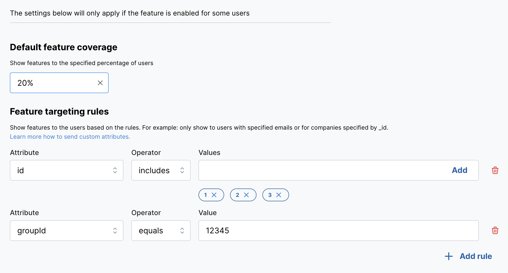
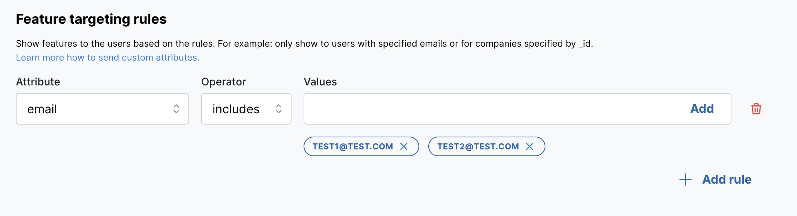
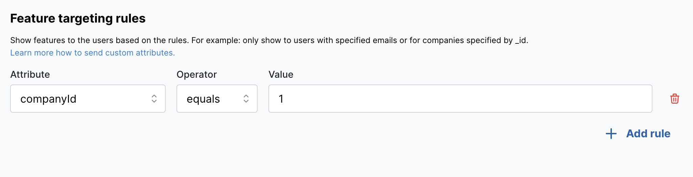

# Dynamic users targeting

To use dynamic targeting rules pass user data to the [fetchFeatureFlags](./sdk-api/fetch-feature-flags.md) and configure rules on the Feature settings page.

There are two operators available in rules: 
- equals (for a string value),
- includes (for an array of strings value).

Targeting rules can be used together with the feature coverage by percent of users.


### Example
1. Filter by email
```
const featureFlags = await flags.fetchFeatureFlags({ email: 'test1@test.com' })
```


2. Filter by company id
```
const featureFlags = await flags.fetchFeatureFlags({ 
  email: 'test1@test.com',
  data: {
     companyId: '1'
  } 
})
```

