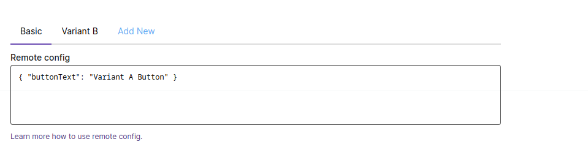
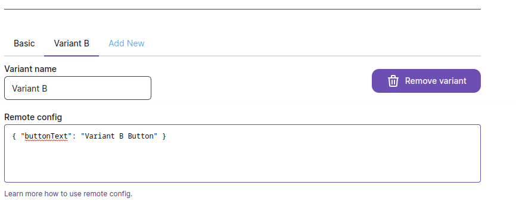

# A/B Tests Analytics Example

This example shows how to use the SDK to track A/B tests analytics.

## Example
In this example we fetch feature flags for the user and then render the page depending on the variant of the feature.
And we track the button clicks with the variant name. So we can see how many users clicked the button in each variant.

#### Setup in GrowthFlags dashboard:
Create a feature `theFeature` with two variants `variant-a` and `variant-b`.

Variant `variant-a` has remote config:
```JSON
{
  "buttonText": "Variant A Button"
}
```


Variant `variant-b` has remote config:
```JSON
{
  "buttonText": "Variant B Button"
}
```

#### Setup in the code:
We don't need to do anything special to track the analytics. We just need to send the variant name with the event.

```js
import GrowthFlags from '@growthflags/js-sdk';

const flags = GrowthFlags.create({
  publicApiKey: 'pk_3a693ae7b88bf3afb8d9eca2304e7d66ff484a41bba6e211',
  env: 'staging',
});

flags.fetchFeatureFlags({ email: 'someuser@examplemail.com' });

const analytics = {
  sendEvent: (event) => {
    // literally any analyitics you use
  },
};

const Page = () => {
  const { variant } = flags.getFeature('theFeature');
  
  const buttonClickHandler = () => {
    flags.triggerEvent('button-clicked', { variant: variant.name });
    analytics.sendEvent({
      name: 'button-clicked',
      variant: variant.name,
    });
  };
    
  if (variant.name === 'variant-a') {
    return (
      <PageA>
        <PageAContent />
        <Button onClick={buttonClickHandler}>
          {variant.remoteConfig.buttonText}
        </Button>
      </PageA>
    );
  } else if (variant.name === 'variant-b') {
    return (
      <PageB>
        <PageBContent />
        <Button onClick={buttonClickHandler}>
          {variant.remoteConfig.buttonText}
        </Button>
      </PageB>
    );
  }
};
```
